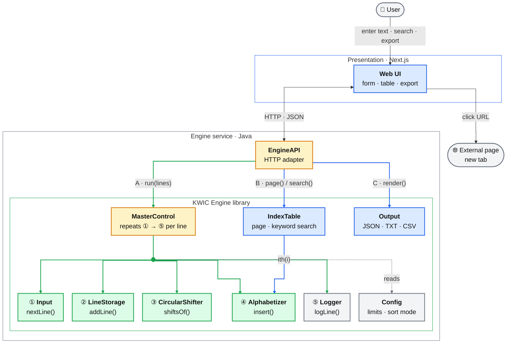
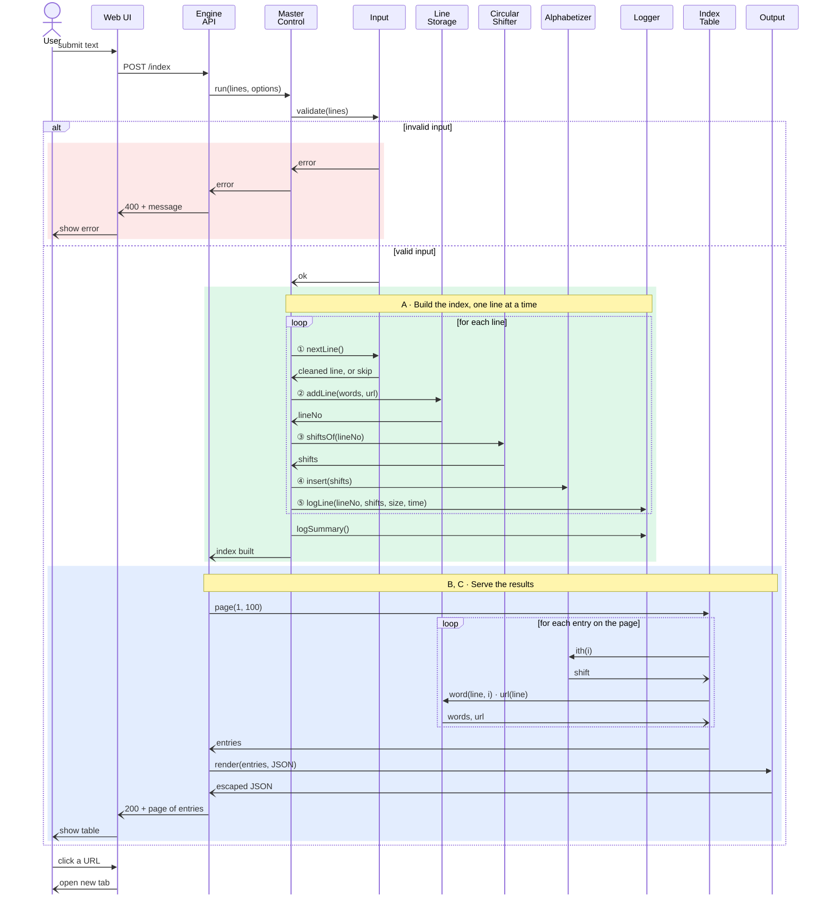
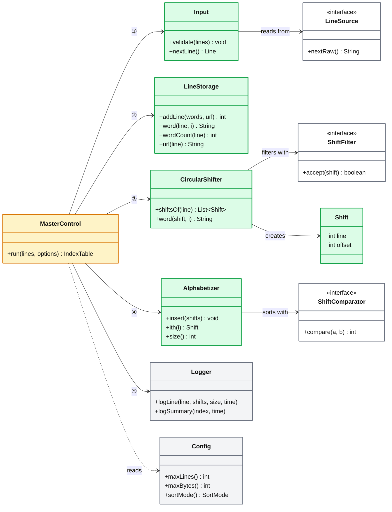
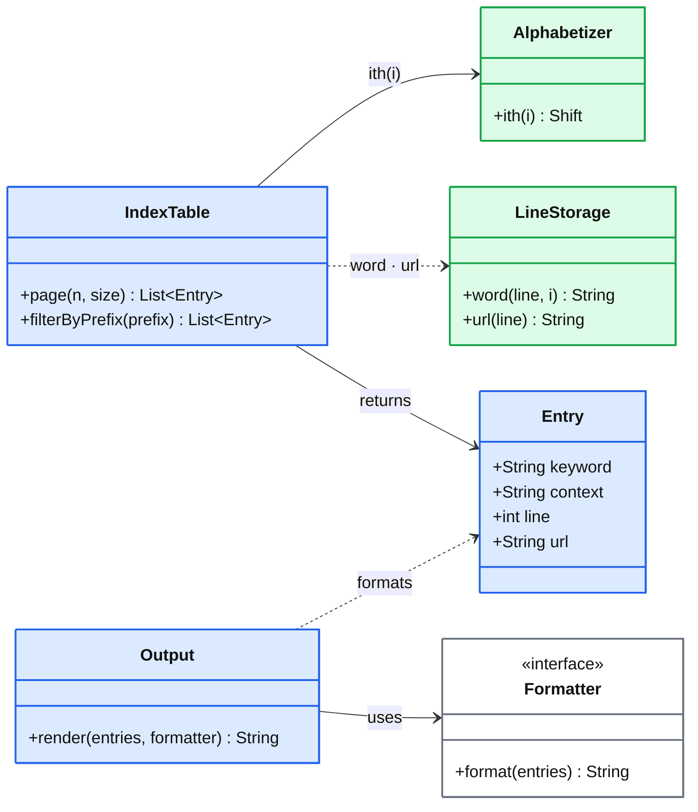

# Quickdex — Architectural Design Decisions

> **Phase I** · CS/SE 6362 Advanced Software Architecture and Design · Fall 2026 · UT Dallas

| | |
| --- | --- |
| **Team** | Yasin Sazid · Alessandro Botta · Sina Moghtased |
| **Version** | 1.0 |
| **Date** | 22 September 2026 |
| **Based on** | [Software Requirements Specification v1.3](SRS.md) |

## Contents

1. [Architectural Style](#1-architectural-style)
2. [Architectural Diagram](#2-architectural-diagram)
3. [Components](#3-components)
4. [Connections](#4-connections)
5. [Constraints](#5-constraints)
6. [Sequence Diagram](#6-sequence-diagram)
7. [Class Diagram](#7-class-diagram)
8. [Rationale](#8-rationale)

---

## 1. Architectural Style

**Object-oriented · Abstract Data Types (ADT).**

Each component owns its own data and hides how that data is stored. Other components can reach
that data only by calling the component's public methods. A single controller, `MasterControl`,
calls the components in order, one line at a time.

---

## 2. Architectural Diagram

**How to read it**

| Element | Meaning |
| ------- | ------- |
| 🟩 green lines | **Build (A):** `MasterControl` calls ① to ⑤ for every line, in order |
| 🟦 blue lines | **Query (B, C):** fetch a page or search result, then format it |
| ⋯ grey dotted line | Read-only use: `MasterControl` reads its settings from `Config` |
| ① … ⑤ in a box | The step number, and the method `MasterControl` calls on that component |
| Line label | The method called on the target component |
| 🟨 yellow box | Control component |
| 🟩 green box | Builds and holds the index |
| 🟦 blue box | Shows or serves the results |
| ⬜ grey box | Support, or outside the system |

Only `LineStorage` holds the text itself. Every other component refers to lines by their number;
`IndexTable` looks up each entry's words and URL in `LineStorage`, as shown in §6.

---

## 3. Components

| Component | Responsibility | Secret it hides | FRs |
| --------- | -------------- | --------------- | --- |
| **Web UI** | Collects input and options, shows the table, and opens URLs in a new tab | Layout and rendering | FR6–FR11 |
| **EngineAPI** | Translates HTTP/JSON requests into engine calls | The wire format | FR6, FR9, FR11 |
| **MasterControl** | Runs each line through the pipeline in order | The order of the steps | FR1, FR5 |
| **Input** | Reads and validates lines, trims spaces, and skips blank lines | Where lines come from (text box, file, sample) | FR1, FR7 |
| **LineStorage** | Stores each line's words, line number, and URL | How text is kept in memory | FR1 |
| **CircularShifter** | Produces the shifts of a line as *(line, offset)* references | Whether shifts are copied or computed on demand | FR2, FR3 |
| **Alphabetizer** | Inserts each shift into the sorted index at its correct place | The sorting algorithm and comparison rule | FR4, FR8 |
| **IndexTable** | Answers page and keyword-prefix queries on the sorted index | How entries are looked up | FR9 |
| **Output** | Formats entries as JSON, plain text, or CSV, and escapes user text | Which formats exist | FR9–FR11 |
| **Logger** | Writes per-line and summary logs | Where logs go | FR5 |
| **Config** | Supplies input limits, sort mode, and noise words | Where settings are stored | NFR5 |

---

## 4. Connections

| From → To | Type | What passes |
| --------- | ---- | ----------- |
| User → Web UI | Browser interaction | Text, file, options, clicks |
| Web UI → EngineAPI | HTTP request/response · JSON | Lines + URLs + options → one page of entries |
| EngineAPI → MasterControl, IndexTable, Output | Method call | Build, query, and format requests |
| MasterControl → engine components | Method call | One line at a time |
| CircularShifter → LineStorage | Method call | `word(line, i)`; the text itself is never copied |
| Alphabetizer → CircularShifter | Method call | Words of two shifts, to compare them |
| IndexTable → Alphabetizer, LineStorage | Method call | The *i*-th shift and its line's URL |
| Web UI → external page | Hyperlink, `target="_blank"` | The entry's URL |

---

## 5. Constraints

1. **Interfaces only.** Components communicate only through public methods. No component reads
   another component's data directly.
2. **Single owner of text.** Only `LineStorage` holds words and URLs. Shifts are
   *(line, offset)* pairs.
3. **Incremental processing.** Lines are processed one at a time, in input order. After each line
   the index is fully sorted, and earlier lines are never reprocessed.
4. **One controller.** Only `MasterControl` knows the order of the steps.
5. **Engine independence.** The engine uses only the Java standard library. It has no
   dependency on HTTP, the UI, or the file system.
6. **Limits at the edge.** `Input` rejects empty input and input larger than 10,000 lines or
   1 MB before any processing starts.
7. **Safe output.** `Output` escapes all user text. The Web UI renders it as text, never as HTML.

---

## 6. Sequence Diagram

Creating an index, then opening a result. Filled arrowheads (▶) are calls; open arrowheads (›)
are returns.

---

## 7. Class Diagram

The diagram is split in two, following the two flows in §2. Arrows point from the caller to the
class it uses; a dotted arrow means the class is only read from. The colors match §2, and
white boxes are interfaces (the extension points).

### 7.1 Build side (flow A)

`CircularShifter` reads words from `LineStorage`, and `Alphabetizer` compares shifts through
`CircularShifter.word()` (§4). These read-only links are left out of the diagram to keep it
readable.

### 7.2 Query side (flows B, C)

Only the methods used by the query side are shown for `Alphabetizer` and `LineStorage`; their
full interfaces are in §7.1.

**Interface implementations**

| Interface | Implementations | Phase |
| --------- | --------------- | ----- |
| `LineSource` | `TextBoxSource` · `FileSource` · `SampleSource` | I |
| `ShiftFilter` | `AcceptAllFilter` | I |
| | `NoiseWordFilter` | II (FR3) |
| `ShiftComparator` | `CaseInsensitiveComparator` | I |
| | `CaseSensitiveComparator` | II (FR8) |
| `Formatter` | `JsonFormatter` · `TextFormatter` · `CsvFormatter` | I |

---

## 8. Rationale

### 8.1 Why Abstract Data Types

| Alternative style | Why not chosen for Quickdex |
| ----------------- | --------------------------- |
| **Shared data (main program + subroutines)** | Every module reads the same data structures, so changing how lines are stored breaks all of them (fails NFR6). |
| **Pipe and filter** | Handles line-by-line flow well, but the filters can't share one stored index, and the IndexTable queries (FR9) need it. |
| **Implicit invocation (events)** | Suits incremental updates, but the control flow is hard to follow and harder to test (weakens NFR1). |

ADT keeps the data hidden, as shared data can't, and keeps the control flow explicit, as
implicit invocation can't. That combination fits the NFRs below.

### 8.2 NFR → decision

| NFR | Decision | Why it satisfies the NFR |
| --- | -------- | ------------------------ |
| **NFR1 Understandability** | One component per responsibility, named as in the SRS | Each FR maps to a single named class (§3), so it can be found in minutes |
| **NFR2 Enhanceability** | `LineSource`, `ShiftComparator`, `ShiftFilter`, `Formatter` interfaces | A new input source, sort rule, filter, or export format is one new class |
| **NFR3 Reusability** | The engine is a plain Java library, and `EngineAPI` is a separate adapter | A CLI or another service can call `MasterControl` directly |
| **NFR4 Performance** | Shifts are *(line, offset)* references, and each shift is inserted into its sorted position once | No copying of text and no full re-sort after each line |
| **NFR5 Adaptability** | Limits, sort mode, and noise words come from `Config` | These values change without a code change or rebuild |
| **NFR6 Modifiability** | Each component hides one secret (§3) | Changing the storage format or sort algorithm touches only one class |
| **NFR7 Portability** | Only the Java standard library in the engine, and only standard web APIs in the UI | Runs on any OS and any major browser |
| **NFR8 Usability** | A single-page Web UI, with errors returned as plain messages | Enter → submit → view, with no navigation |
| **NFR9 Responsiveness** | `IndexTable` returns one page at a time; the UI is responsive | Small responses and fast filtering |
| **NFR10 Reliability** | `Input` checks the limits first; `MasterControl` catches and reports errors | Bad input never reaches the engine's core |
| **NFR11 Security** | `Output` escapes all text and guards CSV cells; links use `rel="noopener"` | User text can't run as code, and opened pages can't control Quickdex |

### 8.3 Trade-offs

| Cost | Accepted because |
| ---- | ---------------- |
| Extra method calls, since each word is read through `LineStorage` | The overhead is small at 10,000 lines and stays within NFR4's 2 s target |
| Inserting in sorted order costs more than one sort at the end | It keeps the index usable and loggable after every line (FR4, FR5) |
| More interfaces than Phase I strictly needs | They are the extension points for Phase II (FR3, FR8) |
