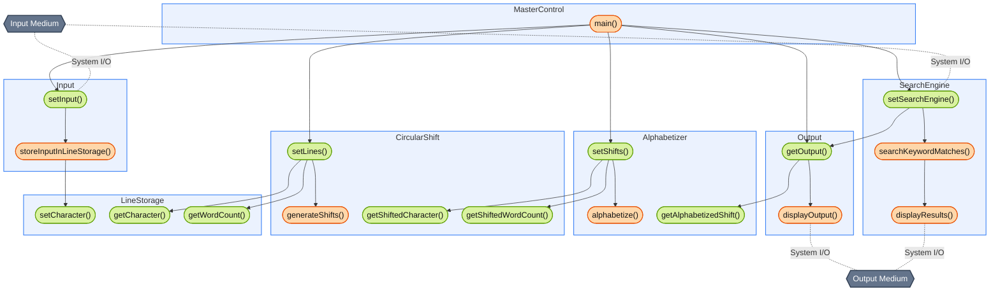
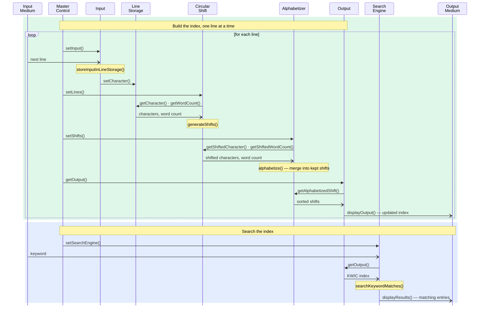
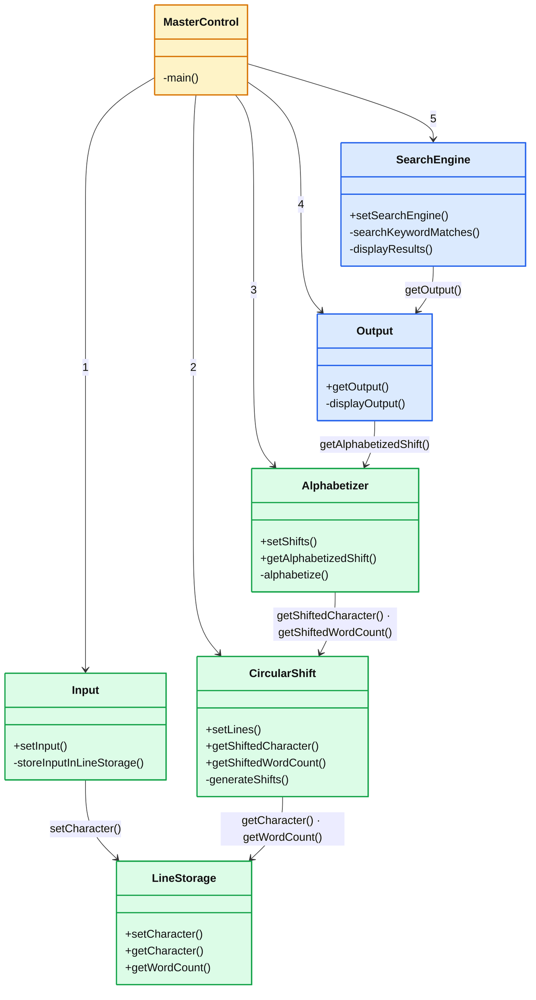

# Quickdex — Architectural Design Decisions

> **Phase I** · CS/SE 6362 Advanced Software Architecture and Design · Fall 2026 · UT Dallas

| | |
| --- | --- |
| **Team** | Yasin Sazid · Alessandro Botta · Sina Moghtased |
| **Version** | 2.0 |
| **Date** | 27 September 2026 |
| **Based on** | [Interim Project I requirements](INTERIM1.md) · Architectural design presentation ([Quickdex.pptx](Quickdex.pptx)) |

## Contents

1. [Architectural Style](#1-architectural-style)
2. [From the Reference Design to Ours](#2-from-the-reference-design-to-ours)
3. [Architectural Diagram](#3-architectural-diagram)
4. [Components](#4-components)
5. [Connections](#5-connections)
6. [Constraints](#6-constraints)
7. [Sequence Diagram](#7-sequence-diagram)
8. [Class Diagram](#8-class-diagram)
9. [Rationale](#9-rationale)
10. [Implementation](#10-implementation)

---

## 1. Architectural Style

**Abstract Data Type (ADT)**, based on the KWIC design by Shaw and Garlan [1].

Each component owns its data and hides how that data is stored and processed. Other components
reach that data only through the component's **public operations**; everything else is
**private**. A single controller, `MasterControl`, calls the components in order, one line at a
time.

---

## 2. From the Reference Design to Ours

We started from Shaw and Garlan's ADT diagram [1]. It had five problems:

| Problem | Description |
| ------- | ----------- |
| **Unclear operation names** | Operations such as `char`, `word`, `alpha`, and `i-th` were too vague. |
| **Mixed responsibilities** | Input, processing, and output tasks were not clearly separated. |
| **Poor encapsulation** | Internal processing was exposed instead of being hidden behind public interfaces. |
| **Unclear module interfaces** | It was not obvious what data each module receives and returns. |
| **Weak separation of business logic** | Shift generation and alphabetization were not clearly isolated from data access. |

We made four changes to fix them:

| Change | Before | After |
| ------ | ------ | ----- |
| **Descriptive names** | Vague operation names | Every operation has a descriptive name (table below) |
| **Input split** | Reading and storing input were not separated | `Input` reads with `setInput()` and stores with the private `storeInputInLineStorage()` |
| **Alphabetizer split** | Input, processing, and retrieval were mixed in `Alphabetizer` | `setShifts()` receives shifts, the private `alphabetize()` sorts them, and `getAlphabetizedShift()` hands them out |
| **Output split** | Retrieving and displaying results were mixed | `Output` retrieves with `getOutput()` and displays with the private `displayOutput()` |

Shift generation and alphabetizing are now private (`generateShifts()`, `alphabetize()`), and
every component shows only green (public) operations to the others.

**Renamed operations**

| Component | Reference name | Quickdex name |
| --------- | -------------- | ------------- |
| `LineStorage` | `setChar()` | `setCharacter()` |
| `LineStorage` | `char()` | `getCharacter()` |
| `LineStorage` | `word()` | `getWordCount()` |
| `CircularShift` | `setup()` | `setLines()` |
| `CircularShift` | `cs-setchar()` | `generateShifts()` *(private)* |
| `CircularShift` | `cs-char()` | `getShiftedCharacter()` |
| `CircularShift` | `cs-word()` | `getShiftedWordCount()` |
| `Alphabetizer` | `alpha()` | `setShifts()` |
| `Alphabetizer` | `i-th()` | `getAlphabetizedShift()` |

---

## 3. Architectural Diagram

```mermaid
%%{init: {"themeVariables": {"fontSize": "17px"}, "flowchart": {"curve": "basis", "nodeSpacing": 30, "rankSpacing": 50, "padding": 10}}}%%
flowchart TB
    IM{{"Input Medium"}}

    subgraph MCg["MasterControl"]
        main(["main()"])
    end

    subgraph SEg["SearchEngine"]
        setSE(["setSearchEngine()"])
        search(["searchKeywordMatches()"])
        results(["displayResults()"])
    end

    subgraph OUTg["Output"]
        getOut(["getOutput()"])
        dispOut(["displayOutput()"])
    end

    subgraph INg["Input"]
        setIn(["setInput()"])
        store(["storeInputInLineStorage()"])
    end

    subgraph ALg["Alphabetizer"]
        setSh(["setShifts()"])
        alpha(["alphabetize()"])
        getAl(["getAlphabetizedShift()"])
    end

    subgraph CSg["CircularShift"]
        setL(["setLines()"])
        gen(["generateShifts()"])
        gsc(["getShiftedCharacter()"])
        gswc(["getShiftedWordCount()"])
    end

    subgraph LSg["LineStorage"]
        setC(["setCharacter()"])
        getC(["getCharacter()"])
        getW(["getWordCount()"])
    end

    OM{{"Output Medium"}}

    main --> setIn
    main --> setL
    main --> setSh
    main --> getOut
    main --> setSE

    setIn --> store
    store --> setC

    setL --> getC
    setL --> getW
    setL --> gen

    setSh --> gsc
    setSh --> gswc
    setSh --> alpha

    getOut --> getAl
    getOut --> dispOut

    setSE --> getOut
    setSE --> search
    search --> results

    IM -. "System I/O" .- setIn
    IM -. "System I/O" .- setSE
    dispOut -. "System I/O" .- OM
    results -. "System I/O" .- OM

    classDef pub fill:#d9f2a0,stroke:#65a30d,stroke-width:1.5px,color:#111
    classDef priv fill:#fed7aa,stroke:#ea580c,stroke-width:1.5px,color:#111
    classDef medium fill:#64748b,stroke:#334155,stroke-width:2px,color:#fff
    class setSE,getOut,setIn,setSh,getAl,setL,gsc,gswc,setC,getC,getW pub
    class main,search,results,dispOut,store,alpha,gen priv
    class IM,OM medium

    style MCg fill:#3b82f61a,stroke:#3b82f6,stroke-width:1.5px
    style SEg fill:#3b82f61a,stroke:#3b82f6,stroke-width:1.5px
    style OUTg fill:#3b82f61a,stroke:#3b82f6,stroke-width:1.5px
    style INg fill:#3b82f61a,stroke:#3b82f6,stroke-width:1.5px
    style ALg fill:#3b82f61a,stroke:#3b82f6,stroke-width:1.5px
    style CSg fill:#3b82f61a,stroke:#3b82f6,stroke-width:1.5px
    style LSg fill:#3b82f61a,stroke:#3b82f6,stroke-width:1.5px
```

**How to read it**

| Element | Meaning |
| ------- | ------- |
| Blue box | A component |
| 🟩 green oval | Public operation, callable by other components |
| 🟧 orange oval | Private operation, used only inside its own component |
| ⬛ dark hexagon | Input or output medium: the web page |
| Solid arrow | A call from one operation to another |
| Dotted line | System I/O between a component and a medium |

---

## 4. Components

| Component | Responsibility | Public operations | Private operations | Secret it hides | FRs |
| --------- | -------------- | ----------------- | ------------------ | --------------- | --- |
| **MasterControl** | Calls the other components in order, once per line, and logs each line | — | `main()` | The order of the steps | FR1, FR5 |
| **Input** | Reads a line from the Input Medium, validates it, and stores it | `setInput()` | `storeInputInLineStorage()` | Where input comes from | FR1, FR6, FR7 |
| **LineStorage** | Stores the characters and words of every line | `setCharacter()` · `getCharacter()` · `getWordCount()` | — | How lines are stored | FR1 |
| **CircularShift** | Generates the circular shifts of each line | `setLines()` · `getShiftedCharacter()` · `getShiftedWordCount()` | `generateShifts()` | How shifts are generated and stored | FR2 |
| **Alphabetizer** | Keeps all shifts in global alphabetical order, merging each new line's shifts in | `setShifts()` · `getAlphabetizedShift()` | `alphabetize()` | The sorting algorithm | FR4 |
| **Output** | Retrieves the sorted shifts and shows them on the Output Medium | `getOutput()` | `displayOutput()` | How results are formatted | FR9–FR11 |
| **SearchEngine** | Takes the user's search words and the KWIC index, finds the matching pages, and shows them | `setSearchEngine()` | `searchKeywordMatches()` · `displayResults()` | How matches are found | FR9, FR10 |
| **Input Medium** · **Output Medium** | Where input comes from and where results go: the web page | — | — | — | FR6, FR9 |

### Search Engine

The KWIC system builds the index; the **SearchEngine** answers searches with it, using three
operations. Every word of a page is the keyword of one index entry, so the index alone can find
pages by any of their words:

| Operation | Visibility | What it does |
| --------- | ---------- | ------------ |
| `setSearchEngine()` | Public | Receives the user's search words from the Input Medium and the KWIC index from `Output` |
| `searchKeywordMatches()` | Private | Finds the pages in which every search word starts a keyword, and ranks them: phrase matches first, then pages with more whole-word matches, then alphabetically |
| `displayResults()` | Private | Shows the matching pages, with their links and matched entries, on the Output Medium |

---

## 5. Connections

| Caller | Callee | Type |
| ------ | ------ | ---- |
| `MasterControl.main()` | `Input.setInput()` | Call |
| `Input.setInput()` | `Input.storeInputInLineStorage()` | Internal call |
| `Input.storeInputInLineStorage()` | `LineStorage.setCharacter()` | Call |
| `MasterControl.main()` | `CircularShift.setLines()` | Call |
| `CircularShift.setLines()` | `LineStorage.getCharacter()` · `LineStorage.getWordCount()` | Call |
| `CircularShift.setLines()` | `CircularShift.generateShifts()` | Internal call |
| `MasterControl.main()` | `Alphabetizer.setShifts()` | Call |
| `Alphabetizer.setShifts()` | `CircularShift.getShiftedCharacter()` · `CircularShift.getShiftedWordCount()` | Call |
| `Alphabetizer.setShifts()` | `Alphabetizer.alphabetize()` | Internal call |
| `MasterControl.main()` | `Output.getOutput()` | Call |
| `Output.getOutput()` | `Alphabetizer.getAlphabetizedShift()` | Call |
| `Output.getOutput()` | `Output.displayOutput()` | Internal call |
| `MasterControl.main()` | `SearchEngine.setSearchEngine()` | Call |
| `SearchEngine.setSearchEngine()` | `Output.getOutput()` | Call |
| `SearchEngine.setSearchEngine()` | `SearchEngine.searchKeywordMatches()` → `displayResults()` | Internal call |
| Input Medium | `Input.setInput()` · `SearchEngine.setSearchEngine()` | System I/O |
| `Output.displayOutput()` · `SearchEngine.displayResults()` | Output Medium | System I/O |

---

## 6. Constraints

1. **Incremental processing.** Processing happens one line at a time.
2. **Incremental merge.** `Alphabetizer` keeps the shifts it has already alphabetized and merges
   the current line's shifts into them.
3. **Output timing.** The output keeps updating as each line is processed.
4. **Information hiding.** Each component exposes (makes public) only the operations that other
   components need.

---

## 7. Sequence Diagram

Creating the index line by line, then searching it. Filled arrowheads (▶) are calls; open
arrowheads (›) are returns.

```mermaid
%%{init: {"sequence": {"mirrorActors": false, "messageAlign": "left", "boxMargin": 8, "noteMargin": 8, "width": 110, "height": 46, "actorMargin": 24}, "themeCSS": ".loopLine { stroke-dasharray: 0 !important; stroke-width: 1.5px; } .messageText, .noteText, .noteText tspan, .loopText, .loopText tspan, .labelText, .labelText tspan, text.actor, text.actor tspan { font-size: 17px !important; } .messageText { font-weight: 500; }"}}%%
sequenceDiagram
    participant IM as Input<br/>Medium
    participant MC as Master<br/>Control
    participant IN as Input
    participant LS as Line<br/>Storage
    participant CS as Circular<br/>Shift
    participant AL as Alphabetizer
    participant OUT as Output
    participant SE as Search<br/>Engine
    participant OM as Output<br/>Medium

    rect rgba(34, 197, 94, 0.14)
        Note over MC,OUT: Build the index, one line at a time
        loop for each line
            MC->>IN: setInput()
            IM-)IN: next line
            Note over IN: storeInputInLineStorage()
            IN->>LS: setCharacter()
            MC->>CS: setLines()
            CS->>LS: getCharacter() · getWordCount()
            LS-)CS: characters, word count
            Note over CS: generateShifts()
            MC->>AL: setShifts()
            AL->>CS: getShiftedCharacter() · getShiftedWordCount()
            CS-)AL: shifted characters, word count
            Note over AL: alphabetize() — merge into kept shifts
            MC->>OUT: getOutput()
            OUT->>AL: getAlphabetizedShift()
            AL-)OUT: sorted shifts
            OUT-)OM: displayOutput() — updated index
        end
    end

    rect rgba(59, 130, 246, 0.14)
        Note over MC,OM: Search the index
        MC->>SE: setSearchEngine()
        IM-)SE: keyword
        SE->>OUT: getOutput()
        OUT-)SE: KWIC index
        Note over SE: searchKeywordMatches()
        SE-)OM: displayResults() — matching entries
    end
```

---

## 8. Class Diagram

Each component is one class. `+` marks a public operation and `-` a private one; arrows point
from the caller to the class it uses.

```mermaid
%%{init: {"themeVariables": {"fontSize": "18px"}, "class": {"padding": 14}}}%%
classDiagram
    direction TB

    class MasterControl {
        -main()
    }
    class SearchEngine {
        +setSearchEngine()
        -searchKeywordMatches()
        -displayResults()
    }
    class Output {
        +getOutput()
        -displayOutput()
    }
    class Alphabetizer {
        +setShifts()
        +getAlphabetizedShift()
        -alphabetize()
    }
    class CircularShift {
        +setLines()
        +getShiftedCharacter()
        +getShiftedWordCount()
        -generateShifts()
    }
    class Input {
        +setInput()
        -storeInputInLineStorage()
    }
    class LineStorage {
        +setCharacter()
        +getCharacter()
        +getWordCount()
    }

    MasterControl --> Input : 1
    MasterControl --> CircularShift : 2
    MasterControl --> Alphabetizer : 3
    MasterControl --> Output : 4
    MasterControl --> SearchEngine : 5

    Input --> LineStorage : setCharacter()
    CircularShift --> LineStorage : getCharacter() · getWordCount()
    Alphabetizer --> CircularShift : getShiftedCharacter() · getShiftedWordCount()
    Output --> Alphabetizer : getAlphabetizedShift()
    SearchEngine --> Output : getOutput()

    style MasterControl fill:#fef3c7,stroke:#d97706,stroke-width:2px,color:#111
    style Input fill:#dcfce7,stroke:#16a34a,stroke-width:2px,color:#111
    style LineStorage fill:#dcfce7,stroke:#16a34a,stroke-width:2px,color:#111
    style CircularShift fill:#dcfce7,stroke:#16a34a,stroke-width:2px,color:#111
    style Alphabetizer fill:#dcfce7,stroke:#16a34a,stroke-width:2px,color:#111
    style Output fill:#dbeafe,stroke:#2563eb,stroke-width:2px,color:#111
    style SearchEngine fill:#dbeafe,stroke:#2563eb,stroke-width:2px,color:#111
```

Yellow is the controller, green builds and holds the index, and blue shows or searches the
results. The numbers on `MasterControl`'s arrows give the order in which `main()` calls each
component.

---

## 9. Rationale

### 9.1 Modifiability of algorithms

The processing algorithms, shift generation (`generateShifts()`) and alphabetizing
(`alphabetize()`), are private to their components. Changing an algorithm, for example the
sorting method, has minimal impact on other components.

### 9.2 Modifiability of data

The data representation is hidden behind each component's operations. Changing how lines,
characters, or shifts are stored (for example, the type of array, or compressed versus
uncompressed) does not require changes to the components that use them, and alternative storage
representations can be swapped in.

### 9.3 Enhanceability

New components can be added for new functionality: noise-word elimination (FR3) will be added in
Phase II. Existing components can be extended without exposing their internal processing, and new
enhancements need minimal changes to other components.

### 9.4 Reusability

Each component has one focused responsibility and makes few assumptions about the others:

| Component | Responsibility |
| --------- | -------------- |
| `Input` | Input acquisition |
| `LineStorage` | Data storage |
| `CircularShift` | Shift generation |
| `Alphabetizer` | Global sorting |
| `Output` | Presentation |

### 9.5 Performance

| | Cost | Why we accept it or how we reduce it |
| - | ---- | ------------------------------------ |
| **Space** | `Alphabetizer` must keep every alphabetized shift for global ordering, so shift storage grows with the total number of circular shifts. Components also keep their own copies of data. | Memory is relatively abundant, so this space cost matters less. |
| **Response time** | Copying data between components costs time. | Incremental processing works in RAM instead of on disk, and incremental sorting (merge sort) avoids re-sorting the whole collection after every line. |

### 9.6 Why Abstract Data Types

| Alternative style | Why not chosen for Quickdex |
| ----------------- | --------------------------- |
| **Shared data (main program + subroutines)** | Every module reads the same data structures, so changing how lines are stored breaks all of them (fails NFR6). |
| **Pipe and filter** | Handles line-by-line flow well, but the filters can't share one stored index, and `SearchEngine` (FR9) needs it. |
| **Implicit invocation (events)** | Suits incremental updates, but the control flow is hard to follow and harder to test (weakens NFR1). |

ADT hides the data, as shared data can't, and keeps the control flow explicit, as implicit
invocation can't. That combination best fits the qualities above, so **we chose the Abstract Data
Type architecture**.

### 9.7 NFR → decision

The same decisions, traced to the non-functional requirements in [Interim Project I](INTERIM1.md#3-non-functional-requirements).

| NFR | Decision | Rationale |
| --- | -------- | --------- |
| **NFR1 Understandability** | Descriptive operation names; one responsibility per component | §2, §9.4 |
| **NFR2 Enhanceability** | New features are new components; internals stay private | §9.3 |
| **NFR3 Reusability** | Focused components with few assumptions; engine independent of the web page | §9.4 |
| **NFR4 Performance** | Incremental processing in memory and incremental merge sort | §9.5 |
| **NFR6 Modifiability** | Algorithms and data representation hidden inside components | §9.1, §9.2 |

---

## 10. Implementation

Each component is one Java class in [`backend/src/main/java/edu/utdallas/quickdex`](../backend/src/main/java/edu/utdallas/quickdex),
with the operation names above. The web page is the Input and Output Medium: an HTTP server
([`api/EngineServer.java`](../backend/src/main/java/edu/utdallas/quickdex/api/EngineServer.java))
passes its text in and streams each `displayOutput()` back as one JSON line.

The implementation adds a few operations that the presentation does not show:

| Component | Added operation | Why |
| --------- | --------------- | --- |
| `LineStorage` | `getLineCount()` · `setUrl()` · `getUrl()` | Numbering new lines, and keeping each line's URL (FR9.0, FR10.0) |
| `CircularShift` | `getShiftCount()` · `getShiftedLine()` · `getShiftedUrl()` | Telling `Alphabetizer` which shifts are new, and where each came from |
| `Alphabetizer` | `getShiftCount()` · `getNewShiftPositions()` | Letting `Output` show only the new entries after each line, without scanning the whole index |
| `Input` | `validate()` | Checking the 10,000-character limit before processing (Interim I FR003) |
| `Output` | `export()` | Downloading the index as CSV or text (FR11.0) |
| `SearchEngine` | `suggestSearches()` | Suggesting searches while the user types (FR12.0) |

The search engine searches a built-in web index of about 130 pages, built at startup from
[`corpus.txt`](../backend/src/main/resources/corpus.txt) (one page per line: a URL and its
description), or any index built in the Indexer.

The web index also grows from an **online source**, which acts as another Input Medium (FR13.0).
For each search, the frontend fetches matching pages from free online sources (Wikipedia, Hacker
News, Stack Overflow, and arXiv, plus Brave Search with an API key), turns each into one
"URL title: description" line, and posts the lines to the backend. The
engine skips URLs it already has and adds the rest through `MasterControl`, one line at a time,
exactly as it processes typed input. The `SearchEngine` then answers from the index. The index
therefore grows with use, which is the incremental processing constraint at work.

The Indexer accepts up to 10,000 Unicode code points per submission, including whitespace, as
specified by Interim I FR003.

---

## References

[1] Shaw, M., & Garlan, D. (1996). *Software Architecture: Perspectives on an Emerging
Discipline*. Englewood Cliffs, NJ: Prentice Hall.
