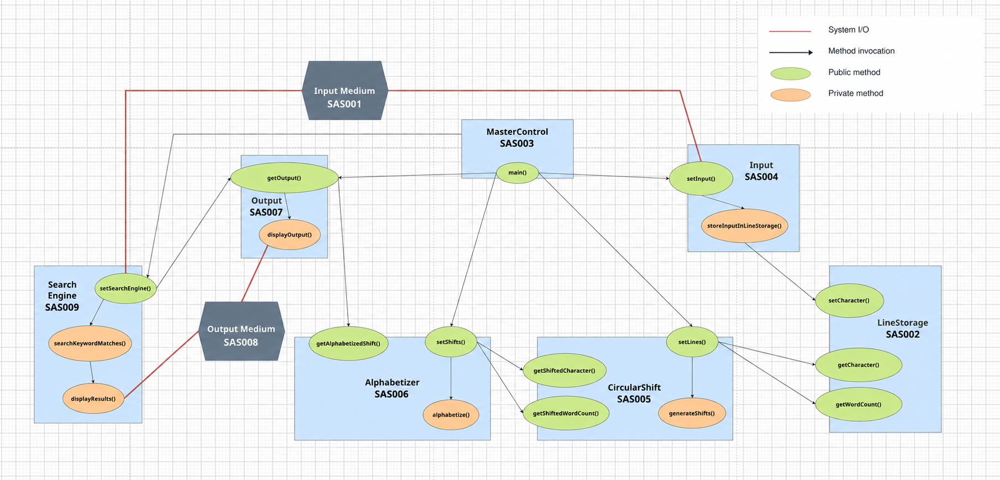

# Quickdex — Interim Project I

**CS/SE 6362 · Advanced Software Architecture and Design · Fall 2026 · UT Dallas**

**Team:** Yasin Sazid · Alessandro Botta · Sina Moghtased

**Date:** 26 September 2026

**Status:** Requirements and team-selected architecture for the Interim I prototype; implementation pending.

## 1. Overview

Quickdex generates and alphabetizes circular shifts of input lines. The webpage
shows input, circular shifts, and alphabetized output, updating after each line.

## 2. Functional requirements

| ID | Requirement |
| --- | --- |
| FR001 | The system shall accept lines of text typed or pasted into a website text box. |
| FR002 | The system shall accept Unicode text and preserve each word's characters. |
| FR003 | The system shall accept between 1 and 10,000 characters of nonblank input. |
| FR004 | The system shall generate all circular shifts of each input line. |
| FR005 | The system shall display the circular shifts before alphabetization. |
| FR006 | The system shall display the shifts in ascending alphabetical order, ignoring case. |
| FR007 | The system shall display the input alongside the circular shifts and alphabetized output. |
| FR013 | The system shall update the displayed results after each line, retaining results from earlier lines. |

## 3. Non-functional requirements

| ID | Quality | Requirement |
| --- | --- | --- |
| NFR001 | Understandability | The system's structure and processing flow shall be easy to understand. |
| NFR002 | Portability | The system shall work across operating systems and web browsers. |
| NFR003 | Enhanceability | The system shall support the addition of new features. |
| NFR004 | Reusability | The KWIC engine shall be reusable independently of the web interface. |
| NFR005 | Performance | The system shall generate and display results quickly. |
| NFR006 | Usability | The system shall be easy for a first-time user to operate. |
| NFR007 | Responsiveness | The system shall provide timely feedback during processing. |
| NFR008 | Adaptability | Changes shall remain localized to the affected components. |

## 4. Traceability to refined requirements

### 4.1 NFRs to more specific NFRs

| Parent | Refined ID | Requirement |
| --- | --- | --- |
| NFR002 | NFR009 | The system shall support Chrome and Firefox on Windows, macOS, and Linux. |
| NFR005 | NFR010 | The system shall display complete results within 3 seconds for supported input under a stable network connection. |
| NFR006 | NFR011 | A first-time user shall complete a submission and understand the results within 5 minutes without a separate manual. |
| NFR004 | NFR012 | The KWIC engine shall run without browser or HTTP services. |
| NFR008 | NFR013 | The sorting implementation shall be replaceable without changing other components or its public interface. |

### 4.2 NFRs to additional FRs

| Parent | Derived ID | Functional requirement |
| --- | --- | --- |
| NFR001, NFR006 | FR008 | The system shall label the input, circular-shift, and alphabetized-output areas. |
| NFR006 | FR009 | The system shall provide on-page instructions. |
| NFR006 | FR010 | The system shall allow users to copy text from both result areas. |
| NFR007 | FR011 | The system shall display a processing status. |
| NFR006, NFR007 | FR012 | The system shall report input or processing errors and allow the user to retry. |

## 5. Architectural style and components

**Style:** object-oriented / Abstract Data Types (ADT).

**Stack:** Next.js front end and Java back end.

SAS = Software Architecture Specification.

| ID | Component | Responsibility |
| --- | --- | --- |
| SAS001 | Input Medium | Accept user text |
| SAS002 | LineStorage | Store lines and hide their representation |
| SAS003 | MasterControl | Coordinate processing one line at a time |
| SAS004 | Input | Read, validate, and store input |
| SAS005 | CircularShift | Generate each line's circular shifts |
| SAS006 | Alphabetizer | Merge new shifts into the sorted index |
| SAS007 | Output | Retrieve and display results |
| SAS008 | Output Medium | Present results to the user |

## 6. Connections

| Caller | Callee |
| --- | --- |
| `MasterControl.main()` | `Input.setInput()` |
| `Input.setInput()` | `Input.storeInputInLineStorage()` |
| `Input.storeInputInLineStorage()` | `LineStorage.setCharacter()` |
| `MasterControl.main()` | `CircularShift.setLines()` |
| `CircularShift.setLines()` | `LineStorage.getCharacter()` |
| `CircularShift.setLines()` | `LineStorage.getWordCount()` |
| `CircularShift.setLines()` | `CircularShift.generateShifts()` |
| `MasterControl.main()` | `Alphabetizer.setShifts()` |
| `Alphabetizer.setShifts()` | `CircularShift.getShiftedCharacter()` |
| `Alphabetizer.setShifts()` | `CircularShift.getShiftedWordCount()` |
| `Alphabetizer.setShifts()` | `Alphabetizer.alphabetize()` |
| `MasterControl.main()` | `Output.getOutput()` |
| `Output.getOutput()` | `Alphabetizer.getAlphabetizedShift()` |
| `Output.getOutput()` | `Output.displayOutput()` |

**System I/O:** Input Medium → Input; Output → Output Medium.

**Pending diagram connection:** Output must also retrieve unsorted shifts from CircularShift.

## 7. Constraints

- Process one line at a time.
- Retain and merge earlier alphabetized shifts.
- Update output after each line.
- Hide internal data and algorithms behind public operations.

## 8. Architecture diagram

Green = public methods; orange = private methods; black arrows = calls; red = system I/O.
SAS009 (Search Engine) is for later work.

## 9. Requirements-to-architecture traceability

### 9.1 Functional requirements

| FR | Architectural elements |
| --- | --- |
| FR001 | SAS001, SAS004 |
| FR002 | SAS002, SAS004 |
| FR003 | SAS004, SAS008 |
| FR004 | SAS002, SAS003, SAS005 |
| FR005 | SAS005, SAS007, SAS008 |
| FR006 | SAS006, SAS007, SAS008 |
| FR007 | SAS001, SAS003, SAS007, SAS008 |
| FR008 | SAS001, SAS008 |
| FR009 | SAS001 |
| FR010 | SAS008 |
| FR011 | SAS001, SAS003, SAS008 |
| FR012 | SAS001, SAS003, SAS008 |
| FR013 | SAS003, SAS005, SAS006, SAS007, SAS008 |

### 9.2 Non-functional requirements

| NFRs | Architectural elements |
| --- | --- |
| NFR001 | SAS001–SAS008 |
| NFR002, NFR009 | SAS001, SAS008 |
| NFR003 | SAS003–SAS007 |
| NFR004, NFR012 | SAS002–SAS006 |
| NFR005, NFR010 | SAS002–SAS008 |
| NFR006, NFR011 | SAS001, SAS008 |
| NFR007 | SAS003, SAS007, SAS008 |
| NFR008, NFR013 | SAS002, SAS004, SAS005, SAS006 |

## 10. Trade-off analysis

**Reference:** [Shaw and Garlan ADT](https://www.cs.cmu.edu/~ModProb/KWICsol2.html).
**Alternative:** Quickdex ADT.

In = Input/LineStorage; CS = CircularShift; Alpha = Alphabetizer; Out = Output.

| Criterion | Reference In | Reference CS | Reference Alpha | Reference Out | Quickdex In | Quickdex CS | Quickdex Alpha | Quickdex Out |
| --- | --- | --- | --- | --- | --- | --- | --- | --- |
| Understandability | + | + | + | + | ++ | ++ | ++ | ++ |
| Algorithm modifiability | + | + | + | + | + | + | + | + |
| Data modifiability | ++ | + | + | 0 | ++ | + | + | 0 |
| Enhanceability | 0 | + | + | 0 | 0 | + | + | 0 |
| Reusability | + | + | + | 0 | + | + | + | 0 |
| Responsiveness: first useful output | 0 | 0 | 0 | − | 0 | + | + | + |
| Performance: processing overhead | 0 | − | − | + | 0 | − | − | − |
| Performance: memory economy | 0 | − | − | 0 | 0 | − | − | 0 |
| Portability: OS/browser | 0 | 0 | 0 | 0 | 0 | 0 | 0 | 0 |
| **Component total** | **+5** | **+3** | **+3** | **+2** | **+6** | **+5** | **+5** | **+3** |

**Architecture totals:** reference **+13**, Quickdex **+19**.
Totals summarize equally weighted design judgments for this scenario; they are not benchmarks.
