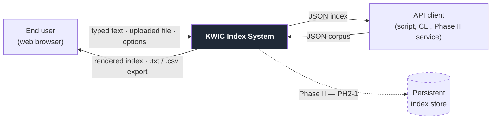

# Software Requirements Specification

## KWIC Index System — Phase I

**CS/SE 6362 — Advanced Software Architecture and Design · Fall 2026**
**The University of Texas at Dallas**

| | |
| --- | --- |
| **Document** | Software Requirements Specification (SRS) |
| **Version** | 1.0 |
| **Date** | 22 September 2026 |
| **Status** | Baselined for Phase I |
| **Prepared by** | Yasin Sazid · Alessandro Botta · Sina Moghtased |

### Revision history

| Version | Date | Author | Change |
| ------- | ---- | ------ | ------ |
| 0.1 | 11 Sep 2026 | Team | Preliminary Project Plan; scope and team roles established |
| 1.0 | 22 Sep 2026 | Team | Initial baseline: requirements elicited, ambiguities resolved, requirements made verifiable |

---

## Table of contents

1. [Introduction](#1-introduction)
2. [Overall description](#2-overall-description)
3. [External interface requirements](#3-external-interface-requirements)
4. [Functional requirements](#4-functional-requirements)
5. [Non-functional requirements](#5-non-functional-requirements)
6. [Verification and traceability](#6-verification-and-traceability)
7. [Open issues](#7-open-issues)
8. [Glossary](#8-glossary)
9. [References](#9-references)
10. [Appendix A — Worked example](#appendix-a--worked-example)
11. [Appendix B — Use cases](#appendix-b--use-cases)

---

# 1. Introduction

## 1.1 Purpose

This document specifies the requirements for the **KWIC (Key Word In Context) Index System**,
the Phase I deliverable of the CS/SE 6362 team project. It defines what the system shall do
and the qualities it shall exhibit, in terms precise enough to be designed against, built
against, and tested against.

It is written for three audiences:

- **The course staff**, who assess whether the requirements are complete, unambiguous, and
  verifiable.
- **The development team**, for whom this document is the single authoritative statement of
  scope. Where this document and any other project artifact disagree, this document governs.
- **Phase II maintainers**, who will extend this system into a web search engine and need to
  know which properties they may rely on.

This document deliberately stops at *what* and *why*. The *how* — architectural style,
component decomposition, and interaction mechanisms — belongs to the Architectural
Specification, which traces back to the identifiers defined here.

## 1.2 Scope

The product is named the **KWIC Index System**.

**The system shall:** accept an ordered set of lines of text; produce every circular shift of
every line; present those shifts in ascending alphabetical order; make the resulting index
inspectable, filterable, and exportable; and do all of this through a publicly reachable web
interface and an equivalent programmatic interface.

**The system shall not**, in Phase I: rank results by relevance, crawl or fetch documents from
external sources, persist a corpus across sessions, authenticate users, or index binary or
structured document formats. These are recorded in §2.7 as Phase II apportionments, and the
architecture is required to accommodate them (NFR-3).

**Objectives.** The system exists to demonstrate that an object-oriented decomposition of a
small, precisely specified problem can satisfy a demanding set of quality attributes
simultaneously. The KWIC problem is chosen because it is small enough to be specified
completely and well known enough that architectural alternatives can be compared honestly
against each other. The resulting index is the substrate on which the Phase II search engine
is built.

## 1.3 Definitions, acronyms, and abbreviations

See §8 [Glossary](#8-glossary).

## 1.4 References

See §9 [References](#9-references).

## 1.5 Document conventions

**Requirement language.** **Shall** marks a binding requirement; a system that fails it fails
the specification. *Should* marks a goal that is desirable but not binding. *May* marks a
permitted option. No other modal verb carries requirement force.

**Identifiers.** Every requirement carries a unique, stable identifier:

| Prefix | Meaning |
| ------ | ------- |
| `FR-n` | Functional requirement (§4) |
| `NFR-n` | Non-functional requirement (§5) |
| `UI-n` | User interface requirement (§3.1) |
| `API-n` | Programmatic interface requirement (§3.2) |
| `CON-n` | Design or implementation constraint (§2.5) |
| `ASM-n` | Assumption (§2.6) |
| `DEP-n` | External dependency (§2.6) |
| `PH2-n` | Requirement apportioned to Phase II (§2.7) |
| `TBD-n` | Open issue (§7) |

Identifiers are never reused and never renumbered. When a requirement is withdrawn its
identifier is retired, so that citations in the architecture specification, test plan, and
commit history remain valid.

**Verification methods.** Each requirement names how its satisfaction is demonstrated:

| Code | Method | Meaning |
| ---- | ------ | ------- |
| **T** | Test | An automated test asserts the behavior |
| **D** | Demonstration | The behavior is observed in the running system |
| **I** | Inspection | A reviewer examines code or documents against a stated criterion |
| **A** | Analysis | The property is established by reasoning or measurement |

A requirement without a verification method is not a requirement; it is an aspiration. Every
requirement in this document carries one.

## 1.6 Overview

§2 describes the product in context — what surrounds it, who uses it, and under what
constraints. §3 specifies its external interfaces. §4 and §5 hold the requirements themselves.
§6 establishes traceability from requirements to architecture and to verification. §7 records
what remains undecided. §8–§9 and the appendices supply supporting material, including a fully
worked example (Appendix A) that fixes the system's semantics by demonstration.

---

# 2. Overall description

## 2.1 Product perspective

The KWIC Index System is a self-contained web application. It depends on no external system to
perform its function: the corpus comes from the user, and the index is computed in full from
that corpus alone. This independence is deliberate and is what makes the reusability and
portability requirements (NFR-2, NFR-4) achievable.



**System boundary.** Everything inside the box labelled *KWIC Index System* is within the scope
of this specification. The browser, the API client, and the Phase II store are outside it. The
dashed edge is apportioned to Phase II and appears here only so that the architecture is
designed with a place to put it.

This section describes the system as a **black box**. Its internal decomposition — the classes,
their interfaces, and the choice among architectural alternatives — is the subject of the
Architectural Specification and is deliberately absent here. §6.2 records the intended
allocation of requirements to components, which is the seam between the two documents.

## 2.2 Product functions

At a summary level, the system:

1. **Acquires** a corpus through any of three user channels or one programmatic channel.
2. **Validates and normalizes** it, rejecting what it cannot process and recording the origin
   of what it accepts.
3. **Shifts** each line circularly, producing one shift per word in the line.
4. **Orders** the complete set of shifts alphabetically across the whole corpus,
   deterministically.
5. **Presents** the ordered index — rendered, paginated, filterable, exportable, and
   inspectable.

Functions 3 and 4 are the KWIC problem proper. Functions 1, 2, and 5 are the clarifications the
assignment invites, and are specified in §4 at the same level of rigor.

## 2.3 User characteristics

| Class | Description | Expertise assumed | Drives |
| ----- | ----------- | ----------------- | ------ |
| **Casual user** | A visitor who wants an index of text they supply. Arrives with no training, no documentation, and little patience. | Can use a web browser. No knowledge of KWIC, indexing, or the underlying terminology. | UI-1 – UI-6, NFR-6, NFR-7 |
| **Demonstrator** | A team member or course grader exercising the system during the Phase I presentation, including inspection of the index table itself. | Understands KWIC and the requirements of this document. | FR-3, FR-26, CON-4 |
| **Integrator** | A developer — including the Phase II team — calling the system programmatically or reusing its core library. | Comfortable with HTTP, JSON, and reading an interface contract. | API-1 – API-5, NFR-4 |

The casual user is the **primary** class. Where the needs of the three conflict, the casual
user's needs prevail in the user interface, and the integrator's prevail in the programmatic
interface — the two are kept separate precisely so that this conflict need not be compromised.

## 2.4 Operating environment

- **Client:** current and immediately prior major release of Chrome, Firefox, Safari, or Edge,
  on desktop or mobile, at viewport widths from 320 px to 2560 px.
- **Server:** Node.js 20 LTS or later.
- **Development:** macOS, Windows, or Linux, using identical commands on each (NFR-2.2).
- **Deployment:** Vercel, deployed automatically from the `main` branch of the GitHub
  repository.
- **Network:** HTTPS. No inbound connection other than the user's browser or an API client is
  required.

## 2.5 Design and implementation constraints

Constraints are imposed on the project rather than derived from the problem. They bound the
design space and are traced, like requirements, in §6.

- **CON-1** The system shall be built in an **object-oriented architectural style**, as
  required by the assignment. The architecture specification shall justify this style against
  at least one alternative and state the consequences of the choice.
- **CON-2** The system shall be reachable through the team's public web page, and that URL
  shall appear in the user manual.
- **CON-3** Implementation shall use the declared stack: Next.js (front end), Node.js (back
  end), GitHub (repository), Vercel (deployment).
- **CON-4** The Phase I prototype shall be demonstrable live, with the contents of the index
  table visible during the presentation.
- **CON-5** All deliverables shall be available both online and offline, in an extended
  IEEE-style document format.
- **CON-6** No requirement shall be satisfied by a mechanism that cannot be demonstrated within
  the Phase I schedule (§1.1 of the Project Plan).

## 2.6 Assumptions and dependencies

**Assumptions** — statements taken as true without proof. If one is falsified, the requirements
depending on it must be revisited.

- **ASM-1** The user supplies text in a writing system for which "alphabetical order" is
  meaningful and for which a total order over code points exists. *(Affects FR-15 – FR-19,
  NFR-8.3.)*
- **ASM-2** A corpus is submitted as one unit of work; the system need not support incremental
  addition of lines to an existing index within Phase I. *(Affects FR-28, PH2-1.)*
- **ASM-3** Corpora are small enough to be held in memory in their entirety on the reference
  hardware. The bound in FR-5 makes this assumption enforceable rather than hopeful.
- **ASM-4** A single user's session is independent of every other's; no requirement depends on
  concurrent users sharing state.

**Dependencies** — external elements the project relies on but does not control.

- **DEP-1** Availability of the Vercel platform for deployment (affects NFR-11.1).
- **DEP-2** Availability of GitHub for source control and for the deployment trigger
  (NFR-11.2).
- **DEP-3** The Node.js 20 LTS runtime and its standard library.
- **DEP-4** Browser conformance to WCAG 2.1 accessibility mechanisms relied on by NFR-6.4.

## 2.7 Apportioning of requirements

The following are explicitly **out of scope for Phase I** and deferred to Phase II. They are
recorded here because the architecture is required to accommodate them without structural
change (NFR-3.1(f), NFR-8.4), and an unrecorded future requirement cannot be designed for.

- **PH2-1** Persist the index in a database so that it survives a session and can be shared
  across users.
- **PH2-2** Rank retrieved entries by relevance rather than returning them in index order.
- **PH2-3** Acquire documents from external sources rather than from direct user submission.
- **PH2-4** Support full-text query over the corpus, beyond the keyword-prefix filter of FR-27.
- **PH2-5** Index formats other than plain text.

---

# 3. External interface requirements

## 3.1 User interfaces

- **UI-1** The system shall present the primary task — submit text, obtain an index — on a
  single screen, without requiring navigation. *(D)*
- **UI-2** The system shall provide, on that screen: a multi-line text input, a file upload
  control, a control to load the sample corpus, the collation and noise-word options, and a
  single control that initiates indexing. *(I)*
- **UI-3** The system shall display the index as a table with three visually distinct columns —
  keyword, context, and source ordinal — with the keyword column aligned so that keywords can
  be scanned vertically. *(D)*
- **UI-4** The system shall display the corpus statistics of FR-22 adjacent to the index, not
  on a separate screen. *(I)*
- **UI-5** The system shall indicate, at all times while indexing is in progress, that work is
  underway (see NFR-7.2). *(D)*
- **UI-6** The system shall present errors adjacent to the control that caused them, not as a
  modal interruption. *(I)*

## 3.2 Software interfaces

- **API-1** The system shall expose an HTTP endpoint accepting `POST` with a JSON body
  containing the corpus as an array of strings and an optional object of indexing options. *(T)*
- **API-2** The endpoint shall respond with a JSON document containing the ordered index, each
  entry carrying its keyword, its full shift, and its source ordinal, plus the statistics of
  FR-22. *(T)*
- **API-3** The endpoint shall use HTTP status codes to distinguish success, malformed request,
  and request exceeding declared bounds, and shall carry a machine-readable error code and a
  human-readable message on failure. *(T)*
- **API-4** The endpoint's request and response schemas shall be documented, versioned, and
  changed only in a backward-compatible manner within a major version. *(I)*
- **API-5** The endpoint shall apply the same bounds, defaults, and semantics as the user
  interface, so that the two cannot diverge in behavior. *(T — shared test corpus exercised
  through both paths)*

## 3.3 Hardware interfaces

The system requires no hardware interface beyond the standard input and display devices of the
client machine. No requirement in this document depends on a specific device capability.

## 3.4 Communications interfaces

- The system shall communicate with clients over HTTPS.
- Request and response bodies shall be UTF-8 encoded JSON, except for file upload (multipart)
  and export (plain text, CSV).

---

# 4. Functional requirements

## 4.1 Interpretation of the given requirement statement

The functional requirement supplied with the assignment is, by design, incomplete: it does not
say where input originates or where output goes, and it leaves several semantic questions open.
A requirement that can be read two ways cannot be tested. The following rulings close each gap.
Each is a decision, not a deduction, and each is realized by a numbered requirement below.

| # | Question left open | Ruling | Realized by |
| - | ------------------ | ------ | ----------- |
| 1 | Where does input come from? | Three user channels — direct text entry, upload of a UTF-8 plain-text file, and a built-in sample corpus — plus one programmatic channel. | FR-1 – FR-4 |
| 2 | Where does output go? | To the browser as a paginated, inspectable table; to the file system as `.txt` and `.csv` exports; to an API client as JSON. | FR-20 – FR-25 |
| 3 | Is the unshifted line itself a shift? | Yes. A line of *n* words yields exactly *n* shifts, including the degree-0 line. A one-word line yields one shift. | FR-10, FR-11 |
| 4 | What does "alphabetical" mean for mixed case? | Case-insensitive at the primary level by default; case-sensitive available by user selection. Exact ties break by source ordinal, then shift degree. | FR-15 – FR-17 |
| 5 | Are duplicate lines or shifts collapsed? | No. Every shift of every accepted line appears; identical shifts are distinguished by source ordinal. | FR-13, FR-16 |
| 6 | Is ordering per line or corpus-wide? | Corpus-wide. One globally ordered index. | FR-19 |
| 7 | What separates words? | Any maximal run of whitespace. Punctuation belongs to the word and is preserved. | FR-6, FR-8 |
| 8 | Is the corpus bounded? | Yes, by a configurable ceiling. Oversized input is rejected with an explanation, never silently truncated. | FR-5 |
| 9 | *Extension:* noise words | Optional filtering suppresses shifts whose **keyword** is a noise word, retaining that line's other shifts. Off by default. | FR-14 |
| 10 | *Extension:* retrieval | Keyword-prefix filtering over the generated index — the first increment toward the Phase II search engine. | FR-27 |

Ruling 4 deserves note. Determinism is not decoration: without a total order, two runs over the
same corpus may differ, and the automated tests of NFR-10.3 would be unable to assert an exact
expected output. The tie-break exists to make the system testable.

Appendix A works a complete example through every ruling above.

## 4.2 Input acquisition

- **FR-1** The system shall accept a corpus entered directly by the user in a multi-line text
  field, treating each newline as a line boundary. *(D)*
- **FR-2** The system shall accept a corpus uploaded as a UTF-8 plain-text file, treating each
  newline-terminated record as one line, and accepting both LF and CRLF terminators. *(T)*
- **FR-3** The system shall provide at least one built-in sample corpus, loadable in a single
  user action, so that the system can be demonstrated without user-supplied data. *(D)*
- **FR-4** The system shall expose the indexing capability through a programmatic interface
  (§3.2), so that the core is usable by clients other than the web interface. *(T)*
- **FR-5** The system shall enforce a configurable upper bound on corpus size — default 10,000
  lines or 1 MB, whichever is reached first — and shall reject a larger corpus with an
  explanatory message rather than truncating it or degrading silently. *(T)*

## 4.3 Validation and normalization

- **FR-6** The system shall treat any maximal run of whitespace as a single word separator, and
  shall discard leading and trailing whitespace on every line. *(T)*
- **FR-7** The system shall ignore blank lines and lines consisting solely of whitespace; such
  lines shall contribute no shifts. *(T)*
- **FR-8** The system shall preserve the original capitalization and punctuation of every word
  in all output. Normalization shall affect ordering only, never displayed text. *(T)*
- **FR-9** The system shall record, for every accepted line, its source ordinal, so that every
  output entry can be traced to the line that produced it. *(T)*

## 4.4 Circular shifting

- **FR-10** The system shall generate, for each accepted line of *n* words, exactly *n* circular
  shifts, where the shift of degree *k* is formed by removing the first *k* words and appending
  them, in order, to the end of the line. *(T)*
- **FR-11** The system shall include the unshifted line — degree 0 — among the circular shifts
  of that line. *(T)*
- **FR-12** The system shall not alter the stored corpus when generating shifts; the corpus
  shall remain available for re-indexing under different options. *(T)*
- **FR-13** The system shall record, for every shift, its source ordinal and its degree, and
  shall designate the first word of the shift as that shift's keyword. *(T)*
- **FR-14** When noise-word filtering is enabled, the system shall omit every shift whose
  keyword appears in the configured noise-word list, while retaining all other shifts of the
  same line. *(T)*

## 4.5 Alphabetization

- **FR-15** The system shall place the complete set of circular shifts in ascending alphabetical
  order, comparing shifts word by word and, within a word, character by character. *(T)*
- **FR-16** The system shall order case-insensitively at the primary level by default, and shall
  break exact ties deterministically by source ordinal and then by shift degree, so that a given
  corpus and option set always produce a byte-identical index. *(T)*
- **FR-17** The system shall allow the user to select case-sensitive collation before indexing.
  *(D)*
- **FR-18** Where one shift is a proper prefix of another, the system shall order the shorter
  shift first. *(T)*
- **FR-19** The system shall order the index globally across the whole corpus, not within each
  source line. *(T)*

## 4.6 Output and presentation

- **FR-20** The system shall display the ordered index as a scrollable, paginated table in which
  each entry shows its keyword, its context, and its source ordinal. *(D)*
- **FR-21** The system shall visually distinguish the keyword from its context in every
  displayed entry. *(I)*
- **FR-22** The system shall report the number of lines accepted, the number of lines ignored,
  and the total number of shifts produced. *(D)*
- **FR-23** The system shall allow the user to download the complete ordered index as plain text
  — one shift per line — and as CSV carrying keyword, shift, and source ordinal. *(D)*
- **FR-24** The system shall return the ordered index as JSON from the interface of FR-4,
  carrying the same fields as the CSV export. *(T)*
- **FR-25** The system shall paginate displayed output at a configurable page size — default 100
  entries — and shall not render an entire index larger than one page at once. *(A)*

## 4.7 Index inspection and retrieval

- **FR-26** The system shall present the generated index in a form that can be inspected
  directly during demonstration, showing each entry's keyword, context, and source ordinal.
  *Satisfies CON-4.* *(D)*
- **FR-27** The system shall allow the user to filter the displayed index by keyword prefix,
  returning every entry whose keyword begins with the entered string. *(T)*
- **FR-28** The system shall retain the most recently generated index for the duration of the
  user's session, so that filtering and pagination do not require re-indexing. *(T)*

## 4.8 Error handling

- **FR-29** On empty input, the system shall not attempt indexing, and shall state that at least
  one non-blank line is required. *(T)*
- **FR-30** On input it cannot decode or does not accept, the system shall reject the request
  with a message naming both the cause and the corrective action, and shall leave any previously
  generated index intact and visible. *(T)*
- **FR-31** The system shall report every rejection through the user interface; no failure shall
  be silent, and no raw exception text shall reach the user. *(T)*

---

# 5. Non-functional requirements

The assignment names eight qualities and characterizes the set as ambiguous. It is. Each of the
eight is a word, not a requirement: none of them, as given, can be passed or failed. Each is
therefore refined below in three steps — **as stated → what is ambiguous → our ruling** — and
then decomposed into criteria that carry a threshold and a verification method. Four further
qualities (NFR-9 – NFR-12) are added by the team; each is justified where it appears.

## 5.1 NFR-1 Understandability

> **As stated:** "easily understandable."
> **Ambiguity:** Understandable **by whom** — an end user or a maintainer? **Of what** — the
> code, the architecture, the documentation, or the output? **To what depth** — enough to use,
> to modify, or to re-derive?
> **Ruling:** NFR-1 governs the **development artifacts** as encountered by a **maintaining
> developer new to the project**, to the depth required to make a change safely.
> Understandability of the running system by an end user is a distinct quality, specified as
> usability in §5.6.

- **NFR-1.1** Every public class, method, and module interface shall carry a documentation
  comment stating its purpose, its parameters, its return value, and its error conditions. *(I)*
- **NFR-1.2** A developer new to the project shall identify the module implementing any numbered
  functional requirement within 5 minutes, using the traceability matrix of §6.2 alone.
  *(D — performed with a team member who did not write the module)*
- **NFR-1.3** No method shall exceed 40 source lines or a cyclomatic complexity of 10; any
  exception shall be justified in review. *(A)*
- **NFR-1.4** Module names shall correspond one-to-one with the components named in the
  architectural specification, and a single documented naming convention shall hold throughout.
  *(I)*

## 5.2 NFR-2 Portability

> **As stated:** "portable."
> **Ambiguity:** Portable across **operating systems**, **browsers**, **language runtimes**,
> **deployment targets**, or **data encodings**? These are five distinct claims, and a system
> can satisfy any one while failing the rest.
> **Ruling:** All five are in scope, and each is stated separately so that none can be claimed
> on the strength of another.

- **NFR-2.1** The core indexing logic shall depend only on the language standard library — no
  operating-system, browser, framework, or file-system API. *(I — review of imports)*
- **NFR-2.2** The system shall build and pass its full test suite on macOS, Windows, and Linux
  under Node.js 20 or later, using identical commands. *(T)*
- **NFR-2.3** The user interface shall be fully functional on the current and immediately prior
  major release of Chrome, Firefox, Safari, and Edge. *(D)*
- **NFR-2.4** Moving between deployment targets shall require no source change; environment
  differences shall be confined to configuration. The same commit shall run locally and on
  Vercel. *(D)*
- **NFR-2.5** Input and output shall use UTF-8, and line-terminator handling shall be
  platform-independent. *(T)*

## 5.3 NFR-3 Enhanceability

> **As stated:** "enhanceable."
> **Ambiguity:** No architecture is modifiable in the abstract — only **with respect to a stated
> set of changes**. A structure that absorbs one change cheaply may make another ruinous. The
> assignment names no changes, so the term as given cannot be assessed.
> **Ruling:** We name the anticipated changes explicitly and require that each be accommodated
> without disturbing unrelated modules. This list is the yardstick against which architectural
> alternatives are compared in the Architectural Specification.

**Anticipated changes:**

| | Change |
| - | ------ |
| (a) | Add an output format |
| (b) | Change the collation rule |
| (c) | Change the definition of a circular shift |
| (d) | Add an input channel |
| (e) | Enable or alter noise-word filtering |
| (f) | Replace the in-memory index with a persistent store (PH2-1) |

- **NFR-3.1** Each anticipated change (a)–(f) shall be implementable by adding one class
  implementing an existing interface, plus one registration entry, with no modification to any
  existing module's interface. *(A + D)*
- **NFR-3.2** No module shall depend on the internal data representation of another; all
  inter-module communication shall pass through published interfaces. *(I)*
- **NFR-3.3** The Architectural Specification shall estimate the effort for each anticipated
  change, and at least one shall be implemented during Phase I to validate the estimate. *(D)*

## 5.4 NFR-4 Reusability

> **As stated:** "reusable."
> **Ambiguity:** Reusable **by whom**, **in what context**, and **at what granularity** — a
> function, a class, a module, or the system entire?
> **Ruling:** The unit of reuse is the **core KWIC library** — line storage, circular shifter,
> alphabetizer — and the target context is **any client that is not this web application**.
> Reuse of the whole system is not claimed.

- **NFR-4.1** The core library shall have no dependency on HTTP, the DOM, the user-interface
  framework, or the file system. *(I)*
- **NFR-4.2** The core library shall be exercisable unmodified from a non-web client — its unit
  tests and a command-line driver — demonstrating context independence. *(T)*
- **NFR-4.3** Every public core operation shall be a pure function of its inputs, relying on no
  global or ambient state. *(I + T)*
- **NFR-4.4** The core library's public interface shall be documented sufficiently for another
  team to use it without reading its implementation. *(I)*

## 5.5 NFR-5 Performance

> **As stated:** "good performance."
> **Ambiguity:** "Good" is unmeasurable. Performance **of which operation**, **at what scale**,
> **on what hardware**, **measured how**, and **at which percentile**?
> **Ruling:** We fix a reference workload and reference hardware and state thresholds against
> them. **Reference corpus C_ref** = 1,000 lines averaging 10 words each, yielding approximately
> 10,000 shifts. **Reference hardware** is the team's development machine, its specification
> recorded in the Test Plan (TBD-1). Thresholds below are provisional until measured (TBD-2).

- **NFR-5.1** Indexing C_ref end to end shall complete within 2 seconds at the 95th percentile
  over 20 runs. *(T)*
- **NFR-5.2** Indexing a 100-line corpus shall complete within 200 ms. *(T)*
- **NFR-5.3** Shift generation shall be O(*N*) and ordering O(*N* log *N*) in the number of
  shifts *N*; measured runtimes at *N* and 4*N* shall agree with the predicted ratio to within
  ±25%. *(A + T)*
- **NFR-5.4** Peak memory use shall not exceed 20× the size of the input corpus. *(A)*
- **NFR-5.5** Keyword-prefix filtering (FR-27) over a materialized index shall return within
  100 ms for C_ref. *(T)*
- **NFR-5.6** No single synchronous operation shall block the user interface for more than
  100 ms. *(T — see NFR-7.1)*

## 5.6 NFR-6 Usability

> **As stated:** "user-friendly."
> **Ambiguity:** Friendly to **which user**, performing **which task**, judged **by what
> measure**? "Friendly" describes a feeling, and feelings are not verifiable.
> **Ruling:** The primary user is a **first-time visitor with no training and no
> documentation**, performing the primary task: *produce an alphabetized index from text I
> supply*. Usability is restated as observable outcomes of that user attempting that task.

- **NFR-6.1** A first-time user shall complete the primary task in no more than three
  interactions — enter text, submit, view result — without consulting documentation. *(D)*
- **NFR-6.2** The purpose of the system and of every control shall be evident from on-screen
  labels alone. *(I)*
- **NFR-6.3** Every error message shall state what happened, why, and what the user should do
  next. No stack trace or internal identifier shall be shown. *(I)*
- **NFR-6.4** The interface shall meet WCAG 2.1 Level AA for contrast, focus visibility, and
  labeling, and every function shall be operable by keyboard alone. *(T + D)*
- **NFR-6.5** The user shall be able to correct input and re-index without losing text already
  entered. *(D)*
- **NFR-6.6** At least three people outside the team shall complete the primary task unaided;
  their completion times and errors shall be recorded in the Test Plan. *(D)*

## 5.7 NFR-7 Responsiveness

> **As stated:** "responsive."
> **Ambiguity:** The term carries **two unrelated meanings** in common use — *temporal*
> responsiveness, meaning the system reacts promptly, and *layout* responsiveness, meaning the
> interface adapts to viewport size. The assignment does not say which is intended, and a system
> can fully satisfy either while failing the other.
> **Ruling:** Both are required, and are stated separately so that neither can be claimed on the
> strength of the other.

**Temporal**

- **NFR-7.1** Every user action shall produce visible feedback within 100 ms. *(T)*
- **NFR-7.2** Any operation exceeding 500 ms shall display a progress indicator and shall not
  block further interaction. *(D)*

**Layout**

- **NFR-7.3** The interface shall be usable without horizontal scrolling at viewport widths from
  320 px to 2560 px. *(T)*
- **NFR-7.4** At every supported width, no content shall overlap or be clipped; index entries
  shall wrap rather than truncate. *(D)*
- **NFR-7.5** The interface shall render legibly under both light and dark color schemes. *(D)*

## 5.8 NFR-8 Adaptability

> **As stated:** "adaptable."
> **Ambiguity:** As commonly used, indistinguishable from enhanceability (§5.3). Two
> requirements that cannot be told apart are one requirement stated twice, and neither can be
> verified independently.
> **Ruling:** We separate them by **who acts and at what cost**. *Enhanceability* covers changes
> a **developer** makes by modifying source and rebuilding. *Adaptability* covers changes a
> **deployer or user** makes through configuration, with no source change and no rebuild.

- **NFR-8.1** The noise-word list, default page size, default collation mode, and corpus size
  limits shall be configurable externally, without editing source. *(D)*
- **NFR-8.2** A configuration change shall require no rebuild, and documented defaults shall
  apply when configuration is absent or incomplete. *(T)*
- **NFR-8.3** The system shall index text in any UTF-8 script without code change;
  language-specific collation shall be selectable rather than hard-coded. *(T)*
- **NFR-8.4** The index store shall be selectable by configuration, so that the Phase II
  persistent store (PH2-1) can replace the in-memory store without altering calling code. *(A)*

## 5.9 NFR-9 Robustness

> **Added by the team.** Reliability is implied by CON-4 — a system that crashes cannot be
> demonstrated — but is never stated. Without it, both "good performance" and "user-friendly"
> could be satisfied by a system that fails on unusual input, since neither says anything about
> what happens when the input is strange.

- **NFR-9.1** No input within the declared bounds shall cause abnormal termination. *(T)*
- **NFR-9.2** The boundary suite shall include: a one-word line; single-character words;
  punctuation-only lines; lines of repeated identical words; a corpus at exactly the size limit;
  and non-Latin script. All shall be handled without error. *(T)*
- **NFR-9.3** After any rejected request, the system shall remain fully operable without reload.
  *(D)*

## 5.10 NFR-10 Testability

> **Added by the team.** Every requirement in this document names a verification method. That
> commitment is only credible if the system is built so the verification can actually be
> performed.

- **NFR-10.1** Every functional requirement shall be covered by at least one automated test
  citing its identifier. *(I)*
- **NFR-10.2** Statement coverage of the core library shall be at least 85%. *(T)*
- **NFR-10.3** All tests shall be deterministic and repeatable, relying on the guarantee of
  FR-16. *(T)*

## 5.11 NFR-11 Availability and deployability

> **Added by the team.** CON-2 requires the system to be reachable at a published URL. A
> requirement to be reachable is empty without a statement of how reliably.

- **NFR-11.1** The published team URL shall be reachable at least 99% of the time during the
  grading window. *(A)*
- **NFR-11.2** A merge to `main` shall deploy automatically, with no manual step. *(D)*
- **NFR-11.3** The deployed build shall be traceable to the exact commit it was built from.
  *(I)*

## 5.12 NFR-12 Safety of user-supplied content

> **Added by the team.** The system's defining characteristic is that it renders text supplied
> by an untrusted party back into a page. That is the precise shape of an injection defect, and
> no other requirement in this document forbids it.

- **NFR-12.1** User-supplied text shall always be rendered as text and never interpreted as
  markup or code, in every output path — including the CSV export, where a leading `=`, `+`,
  `-`, or `@` shall not be interpretable as a formula by a spreadsheet application. *(T)*
- **NFR-12.2** Uploads shall be bounded in both size and declared type before being read. *(T)*
- **NFR-12.3** User-supplied text shall not be persisted beyond the session without explicit
  user action. *(I)*

---

# 6. Verification and traceability

## 6.1 Verification approach

Each requirement is verified by the method named against it. Aggregate coverage:

| Method | Requirements | Where recorded |
| ------ | ------------ | -------------- |
| **T** Test | Majority of FR-1 – FR-31; NFR-2.2, 2.5, 5.x, 8.2, 8.3, 9.1, 9.2, 10.2, 10.3, 12.1, 12.2 | Automated suite, run on every push |
| **D** Demonstration | FR-1, 3, 17, 20, 22, 23, 26; NFR-1.2, 2.3, 2.4, 6.1, 6.5, 6.6, 7.2, 7.4, 7.5, 8.1, 9.3, 11.2 | Phase I presentation script; Test Plan |
| **I** Inspection | FR-21; NFR-1.1, 1.3, 1.4, 2.1, 4.1, 4.3, 4.4, 6.2, 6.3, 10.1, 11.3, 12.3 | Review checklist, applied at pull request |
| **A** Analysis | FR-25; NFR-3.1, 5.3, 5.4, 8.4, 11.1 | Architectural Specification; measurement log |

The Test Plan (Phase I deliverable 3) carries the full requirement-to-test-case matrix. This
document defines the identifiers it cites.

## 6.2 Requirements to architecture

Requirements are grouped so that each group maps onto a single component of the object-oriented
decomposition. The Architectural Specification carries the authoritative matrix and the
rationale; this table records the **intended allocation** and is the seam between the two
documents.

| Requirement group | Planned component | Responsibility | Secret it hides |
| ----------------- | ----------------- | -------------- | --------------- |
| FR-1 – FR-5, UI-2, API-1 | `Input` | Acquire a corpus from any channel and hand it to storage | How a corpus arrived |
| FR-6 – FR-9 | `LineStorage` | Hold lines, words, and ordinals; sole owner of the text representation | How text is represented in memory |
| FR-10 – FR-14 | `CircularShifter` | Produce and describe the shifts of each stored line | Whether shifts are materialized or computed on demand |
| FR-15 – FR-19 | `Alphabetizer` | Impose a total, deterministic order on the shift set | Which ordering algorithm is used |
| FR-20 – FR-25, UI-3, UI-4 | `Output` | Render and export the ordered index | Which formats exist and how they are produced |
| FR-26 – FR-28, API-2 | `IndexTable` | Retain the index; answer inspection and prefix queries | Where the index is stored (see PH2-1) |
| FR-29 – FR-31, UI-5, UI-6 | `MasterControl` | Sequence the pipeline; surface every failure to the user | The order and coupling of the stages |

The fourth column is the load-bearing one. Each component is defined by the decision it
conceals, so that a change to that decision is contained within it — which is precisely what
NFR-3.1 requires and what makes the claim in NFR-3.2 checkable rather than rhetorical.

## 6.3 Non-functional requirements to architectural decisions

Non-functional requirements are cross-cutting; they trace to *decisions* rather than to
components.

| Decision | Satisfies | Costs |
| -------- | --------- | ----- |
| Hide the text representation behind `LineStorage` | NFR-3.2, NFR-1.2 | An indirection on every word access; a performance risk against NFR-5.1 |
| Keep the core free of web, DOM, and file-system dependencies | NFR-4.1, NFR-4.2, NFR-2.1 | Input and output must be adapted at the boundary, adding two classes |
| Make every core operation a pure function | NFR-4.3, NFR-10.3, FR-12 | Shifts cannot be mutated in place; higher peak memory, bounded by NFR-5.4 |
| Break ordering ties by (ordinal, degree) | FR-16, NFR-10.3 | A wider sort key; negligible at C_ref scale |
| Externalize configuration | NFR-8.1, NFR-8.2, NFR-2.4 | A configuration schema to document and validate |
| Select the index store by configuration | NFR-8.4, PH2-1 | An interface that the in-memory store alone does not justify today |

Recording the cost of each decision, not only its benefit, is what allows the Architectural
Specification to argue the choice honestly rather than assert it.

---

# 7. Open issues

| ID | Issue | Owner | Needed by |
| -- | ----- | ----- | --------- |
| **TBD-1** | Reference hardware specification for §5.5 is not yet recorded. | Team | Test Plan |
| **TBD-2** | Performance thresholds in NFR-5.1, 5.2, 5.5 are provisional estimates and shall be re-baselined against the first working prototype. | Team | Interim Project I |
| **TBD-3** | The team role play required by the assignment is described in the updated Project Plan, not here; the cross-reference shall be added once that revision is issued. | Sina Moghtased | Interim Project I |
| **TBD-4** | The published URL required by CON-2 is not yet fixed. | Team | User Manual |
| **TBD-5** | The default noise-word list of FR-14 has not been chosen. | Team | Prototype |
| **TBD-6** | Whether the case-sensitive ordering of FR-17 uses code-point order or a locale-aware collation is undecided; Appendix A assumes code-point order. | Team | Prototype |

An open issue is a requirement that is known to be missing. Leaving it unnamed does not make it
absent from the system — only absent from the specification.

---

# 8. Glossary

| Term | Definition |
| ---- | ---------- |
| **Character** | A single Unicode code point, excluding whitespace and control characters. |
| **Word** | A maximal, non-empty, ordered sequence of characters containing no whitespace. |
| **Line** | An ordered sequence of one or more words, separated by whitespace. |
| **Corpus** | The ordered set of lines submitted as one indexing request. |
| **Circular shift** | For a line `L = (w₁ … wₙ)`, the shift of degree *k* (0 ≤ *k* < *n*) is `(w₍ₖ₊₁₎ … wₙ, w₁ … wₖ)` — the first *k* words removed from the front and appended, in order, to the end. |
| **Degree** | The number of words moved from the front to the back to form a shift. Degree 0 is the unshifted line. |
| **Keyword** | The first word of a circular shift; the word appearing "in context". |
| **Context** | The words of a circular shift following its keyword. |
| **KWIC index** | The complete collection of circular shifts of all lines of a corpus, held in ascending alphabetical order. |
| **Noise word** | A word on a configurable list (e.g. *a*, *the*, *of*) excluded from serving as a keyword. |
| **Source ordinal** | The 1-based position of a line within the corpus as submitted. |
| **Collation** | The rule by which two shifts are compared to determine their order. |
| **C_ref** | The reference corpus defined in §5.5, used for all performance thresholds. |
| **Information hiding** | The principle of assigning to each module a design decision it conceals from all others, so that the decision may change without them. |

**Acronyms:** API — Application Programming Interface · CSV — Comma-Separated Values ·
IEEE — Institute of Electrical and Electronics Engineers · KWIC — Key Word In Context ·
LTS — Long-Term Support · SRS — Software Requirements Specification ·
UTF-8 — 8-bit Unicode Transformation Format · WCAG — Web Content Accessibility Guidelines

---

# 9. References

| # | Reference |
| - | --------- |
| [1] | CS/SE 6362 — *Project Phase I: KWIC Software Architecture & Prototype Implementation*, The University of Texas at Dallas, Fall 2026. |
| [2] | Team, *Preliminary Project Plan*, 11 September 2026. See [`SE6362-PPP.pdf`](SE6362-PPP.pdf). |
| [3] | D. L. Parnas, "On the Criteria To Be Used in Decomposing Systems into Modules," *Communications of the ACM*, vol. 15, no. 12, pp. 1053–1058, December 1972. |
| [4] | IEEE Std 830-1998, *IEEE Recommended Practice for Software Requirements Specifications*. |
| [5] | ISO/IEC/IEEE 29148:2018, *Systems and software engineering — Life cycle processes — Requirements engineering*. |
| [6] | ISO/IEC 25010:2011, *Systems and software Quality Requirements and Evaluation (SQuaRE) — System and software quality models*. |
| [7] | W3C, *Web Content Accessibility Guidelines (WCAG) 2.1*, June 2018. |

---

# Appendix A — Worked example

This appendix fixes the semantics of §4 by demonstration. Every ruling in §4.1 is exercised.
These are the expected outputs; the automated suite asserts them exactly (NFR-10.3).

## A.1 Input corpus

```
Descent of Man
The Ascent of Man
```

Two lines: ordinal 1 has 3 words, ordinal 2 has 4. By FR-10 and FR-11 they yield 3 and 4 shifts
respectively — **7 shifts in total**.

## A.2 Circular shifts, before ordering

| Ordinal | Degree | Shift | Keyword |
| ------- | ------ | ----- | ------- |
| 1 | 0 | Descent of Man | Descent |
| 1 | 1 | of Man Descent | of |
| 1 | 2 | Man Descent of | Man |
| 2 | 0 | The Ascent of Man | The |
| 2 | 1 | Ascent of Man The | Ascent |
| 2 | 2 | of Man The Ascent | of |
| 2 | 3 | Man The Ascent of | Man |

## A.3 Default output — case-insensitive (FR-16)

| # | Keyword | Context | Ordinal |
| - | ------- | ------- | ------- |
| 1 | **Ascent** | of Man The | 2 |
| 2 | **Descent** | of Man | 1 |
| 3 | **Man** | Descent of | 1 |
| 4 | **Man** | The Ascent of | 2 |
| 5 | **of** | Man Descent | 1 |
| 6 | **of** | Man The Ascent | 2 |
| 7 | **The** | Ascent of Man | 2 |

Note entries 3 and 4: both keywords are `Man`, so comparison proceeds to the second word —
`Descent` before `The` (FR-15). Entries 5 and 6 resolve at the third word for the same reason.
Entry 7 shows the effect of case-insensitive collation: `The` sorts under *t*, after `of`.

## A.4 Case-sensitive output (FR-17)

With code-point ordering, all uppercase letters precede all lowercase (see TBD-6):

| # | Keyword | Context | Ordinal |
| - | ------- | ------- | ------- |
| 1 | **Ascent** | of Man The | 2 |
| 2 | **Descent** | of Man | 1 |
| 3 | **Man** | Descent of | 1 |
| 4 | **Man** | The Ascent of | 2 |
| 5 | **The** | Ascent of Man | 2 |
| 6 | **of** | Man Descent | 1 |
| 7 | **of** | Man The Ascent | 2 |

`The` moves from last to fifth. The two orderings differ, which is why FR-17 makes the choice
explicit and user-selectable rather than leaving it to the implementation.

## A.5 Noise-word filtering (FR-14)

With the noise list `{the, of}` and case-insensitive matching, the three shifts whose **keyword**
is a noise word are dropped. The remaining shifts of those lines are kept — this is the
distinction FR-14 draws:

| # | Keyword | Context | Ordinal |
| - | ------- | ------- | ------- |
| 1 | **Ascent** | of Man The | 2 |
| 2 | **Descent** | of Man | 1 |
| 3 | **Man** | Descent of | 1 |
| 4 | **Man** | The Ascent of | 2 |

Line 2 still contributes two entries, though two of its four shifts were suppressed. Note also
that `of` and `The` remain visible *as context* in entries 1, 3, and 4 — filtering removes a
shift from the index, it does not remove a word from the text (FR-8).

## A.6 Boundary cases (NFR-9.2)

| Input | Expected result | Requirement |
| ----- | --------------- | ----------- |
| `Man` | One entry: keyword `Man`, empty context, ordinal 1 | FR-10 with *n* = 1 |
| `` (empty) | No index; message that at least one non-blank line is required | FR-29 |
| `   ` (whitespace only) | Line ignored; treated as empty corpus | FR-7, FR-29 |
| `Man Man` | Two entries, both `Man Man`, distinguished by degree 0 and 1 | FR-10, FR-16 |
| `  Descent   of  Man  ` | Identical to §A.3 line 1 — runs of whitespace collapse, edges trimmed | FR-6 |
| `Descent of Man` submitted twice | 6 entries; duplicates retained, distinguished by ordinal | Ruling 5, FR-16 |

---

# Appendix B — Use cases

### UC-1 — Index text entered directly

**Actor:** Casual user **Requirements:** FR-1, FR-6 – FR-22

1. The user enters one or more lines in the text field.
2. The user initiates indexing.
3. The system validates the corpus, generates shifts, orders them, and displays the first page
   of the index with corpus statistics.

*Alternative 2a:* the corpus is empty or whitespace only — the system states that at least one
non-blank line is required and does not index (FR-29).
*Alternative 2b:* the corpus exceeds the bound — the system reports the limit and the actual
size, and does not index (FR-5).

### UC-2 — Index an uploaded file

**Actor:** Casual user **Requirements:** FR-2, FR-5, FR-30, NFR-12.2

1. The user selects a plain-text file.
2. The system checks its declared type and size before reading it.
3. The flow continues as UC-1 from step 3.

*Alternative 2a:* the file cannot be decoded as UTF-8 — the system rejects it, naming the cause
and the remedy, and leaves any existing index visible (FR-30).

### UC-3 — Demonstrate the index table

**Actor:** Demonstrator **Requirements:** FR-3, FR-26, CON-4

1. The demonstrator loads the built-in sample corpus in one action.
2. The demonstrator initiates indexing.
3. The system displays the index table with keyword, context, and source ordinal for each entry,
   in a form legible to an audience.

### UC-4 — Find entries by keyword prefix

**Actor:** Casual user **Requirements:** FR-27, FR-28, NFR-5.5

1. With an index displayed, the user enters a keyword prefix.
2. The system filters the retained index and displays every entry whose keyword begins with that
   prefix, without re-indexing.

*Alternative 2a:* no entry matches — the system says so plainly and offers to clear the filter.

### UC-5 — Retrieve an index programmatically

**Actor:** Integrator **Requirements:** FR-4, FR-24, API-1 – API-5

1. The client sends a corpus and options as JSON.
2. The system applies the same bounds, defaults, and semantics as the user interface.
3. The system returns the ordered index and the corpus statistics as JSON.

*Alternative 2a:* the request is malformed or exceeds bounds — the system returns the
corresponding status code with a machine-readable error code and a human-readable message
(API-3).

### UC-6 — Export an index

**Actor:** Casual user **Requirements:** FR-23, NFR-12.1

1. With an index displayed, the user requests a download as plain text or CSV.
2. The system produces the **complete** ordered index — not only the displayed page — with
   user-supplied text neutralized against formula interpretation.
