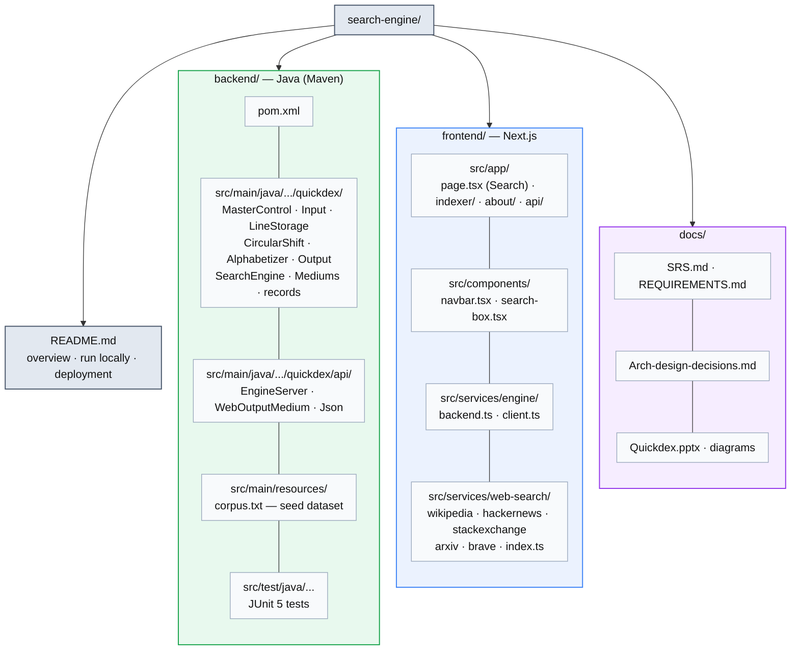
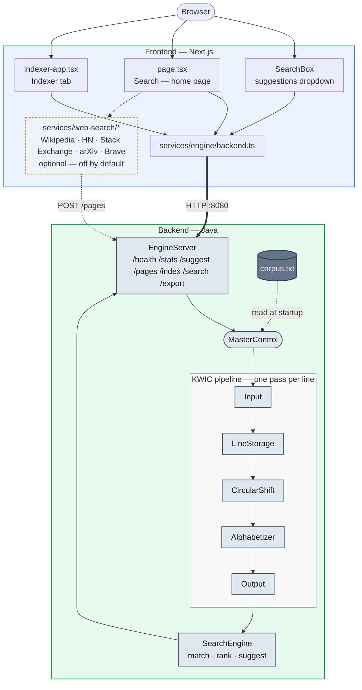

# Quickdex — Folder Structure and Architecture

Companion diagrams to [`Arch-design-decisions.md`](Arch-design-decisions.md): where the code lives,
and how a search request flows through it.

## Folder structure

## Architecture (request flow)

**How to read it**

| Element | Meaning |
| ------- | ------- |
| Blue box | Frontend (Next.js) |
| Green box | Backend (Java) |
| Gray box | A component or pipeline stage |
| Dark hexagon | `corpus.txt`, the seed dataset read at startup |
| Dashed amber box | Optional live web sources — disabled by default in Phase I; `corpus.txt` alone answers searches |
| Thick arrow | The HTTP boundary between frontend and backend (`:8080`) |
| Dotted arrow | An optional or startup-only path |

Two index instances exist at runtime: the **web index**, seeded from `corpus.txt` and searched by
the home page, and any number of **user-built indexes** (Indexer tab, `POST /index`), kept in an
LRU cache. Both run through the identical `MasterControl` pipeline shown above — only the
`InputMedium`/`OutputMedium` differ, which is the information-hiding point of the ADT
architecture (see [`Arch-design-decisions.md`](Arch-design-decisions.md)).
